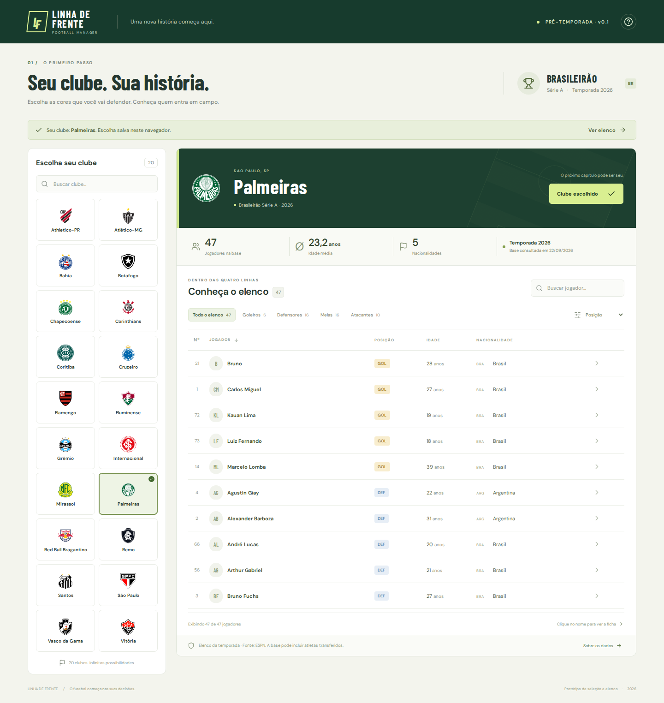
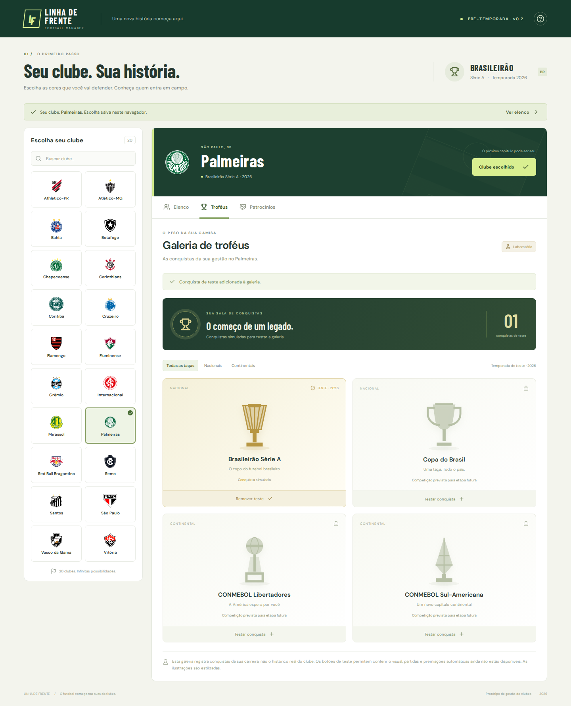
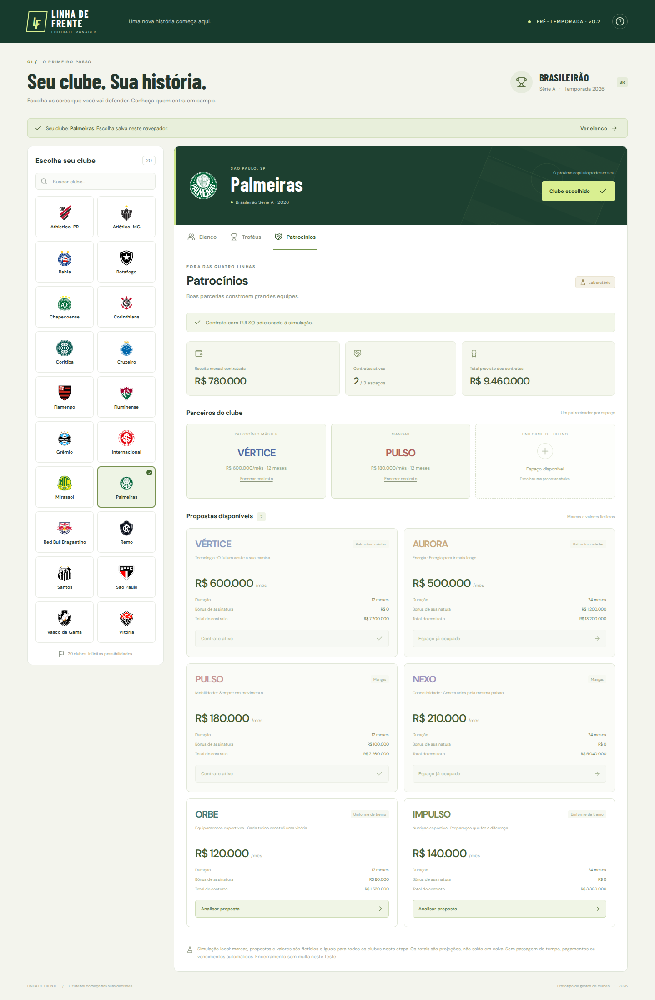

# Linha de Frente — Etapa 2 · v0.5

Simulador de gerenciamento de clubes em Etapa 2: Série A com 38 rodadas funcionais, engine procedural de partidas, tabela e artilharia do save, economia de patrocínios, galeria automática de troféus e área inicial de recordes/Hall da Fama. Interface em português, responsiva, com dados da gestão separados por clube e persistidos no navegador.



## Executar

```sh
npm install
npm run dev
```

Para produção: `npm run build`. O resultado está em `dist/` e pode ser servido por qualquer hospedagem estática. `npm run preview` permite conferir o build local.

## Dados

`src/data/serie-a-2026.json` contém uma fotografia dos cadastros de elenco da temporada 2026 fornecidos pela ESPN, com data e URLs de origem. Os elencos sazonais podem incluir atletas que já saíram do clube e não equivalem a inscrições oficiais da CBF nem a uma garantia de todos os contratos vigentes. Idades são calculadas na data da consulta, quando há nascimento disponível. Dados ausentes são exibidos como não informados. Não há atributos de habilidade, salários ou valores inventados.

Os escudos vêm da ESPN e estão incluídos nos arquivos locais para evitar requisições externas durante a utilização. Marcas pertencem aos respectivos titulares. O protótipo não é afiliado aos clubes, à CBF ou à ESPN.

Para atualizar a fotografia (Python 3, internet, sem chaves):

```sh
npm run data:update
```

O importador exige os 20 clubes esperados da temporada e só substitui a base após todas as consultas serem concluídas. A interface funciona com os dados locais, sem depender da disponibilidade da fonte. A ESPN não oferece SLA contratado por este projeto; integrar uma fonte licenciada e reconciliar transferências/inscrições é uma etapa necessária antes de prometer atualização em tempo real.

## Escopo desta etapa

- **Partida:** protótipo de simulação com visão estática da beira do campo, placar e relógio dinâmicos, eventos, estatísticas, destaques individuais, velocidades 1x/2x/4x e avanço para o próximo lance. O gramado e os jogadores são vetoriais e estáticos para manter baixo custo de renderização.\n- **Elenco:** seleção do clube e inspeção dos jogadores.\n- **Classificação:** tabela de laboratório com 20 clubes, pontos e critérios básicos de ordenação; destaca campeão, G4/Libertadores, 5º na fase preliminar, faixa-base da Sul-Americana e Z4. Os números são fictícios nesta etapa e serão substituídos pela engine de partidas.
- **Troféus:** galeria da carreira com filtros nacionais/continentais. Não contém o histórico real dos clubes. Taças estilizadas e registros simulados de 2026 podem ser adicionados e removidos explicitamente no modo laboratório. Copa do Brasil e competições continentais são apenas cartões para uma etapa futura, não competições já jogáveis.
- **Patrocínios:** seis propostas fictícias para três espaços (máster, mangas e treino), com receita mensal, duração, bônus, valor total, assinatura e encerramento mediante confirmação. Apenas um contrato por espaço. As propostas são iguais para todos os clubes nesta etapa. Os totais representam projeções contratuais; não há saldo, pagamentos, vencimentos automáticos nem multa de rescisão.
- **Persistência:** `ldf.club` salva o clube escolhido; `ldf.management.v1` salva contratos e conquistas de teste por clube. A consulta de outro clube não altera seu estado; só é possível gerenciar o clube escolhido. Falhas ao salvar são sinalizadas na interface. Registros inválidos e duplicados são descartados na leitura.

A simulação de partida agora alimenta classificação, artilharia, patrocínios, caixa e troféus do mesmo save local. A Série A usa calendário de 38 rodadas em turno e returno. Mercado, calendário visual, transferências, investimentos e as demais competições ainda serão conectados. As regras iniciais dos patrocínios estão separadas da interface em `src/management-model.js`.

## Novas telas




## Validação desta versão

Build de produção concluído. Testes no Chromium: abertura dos 20 clubes, contagem dos 941 cadastros, busca com normalização de acentos, filtro por posição, estado vazio, ordenação por idade, ficha de jogador, fechamento de modais, persistência da escolha e layout de 360 e 390 pixels sem rolagem horizontal. Sem erros JavaScript durante esses testes.


### Validação da versão 0.2

`npm test` verifica exclusividade de contratos, cálculo das projeções e saneamento da persistência. Teste de navegação no Chromium verificou assinatura/cancelamento/rescisão, restauração após recarregar, separação entre clubes, adição/remoção de taças, filtros e navegação de volta ao elenco. Telas de 360 e 390 pixels verificadas sem transbordamento horizontal. Build de produção concluído.
\n\n### Validação da versão 0.4\n\n`npm test` cobre relógio, placar, próximo evento e consistência das estatísticas da simulação. A tela de partida usa SVG/CSS estático para o campo e atualiza apenas dados de interface durante o relógio, sem animação de jogadores ou engine gráfica.\n

## Etapa 2 · sistemas funcionais

- **Temporada:** 20 clubes, 38 rodadas e dez partidas por rodada. A engine resolve toda a rodada e mantém resultados no save local.
- **IA procedural de partida:** força baseada em profundidade e equilíbrio do elenco, faixa etária, posições, mando de campo e aleatoriedade determinística por rodada. Gols são distribuídos com pesos por posição. Não há chamada paga de IA nem renderização 3D.
- **Classificação e artilharia:** resultados atualizam pontos, vitórias, saldo, gols marcados e ranking de goleadores; há também ranking acumulado do save.
- **Patrocínios:** propostas fictícias possuem requisitos e modelos distintos de pagamento (à vista, parcelas mensais, trimestrais, por rodada ou performance). O dinheiro entra automaticamente no caixa conforme as rodadas avançam.
- **Troféus:** o campeão da 38ª rodada recebe automaticamente o Brasileirão na galeria.
- **Recordes:** referências históricas carregadas de fontes oficiais incluem Real Madrid com nove títulos mundiais como referência FIFA, Palmeiras com 12 Brasileiros como referência CBF e Roberto Dinamite com 190 gols no Brasileiro. Para o São Paulo, a base histórica mundial carregada é de três títulos (1992, 1993 e 2005). A função de marco mundial já está preparada para futuras competições.
- **Hall da Fama:** estrutura visual para jogadores, clubes e técnicos, ainda sem critérios definitivos de indução.

### Persistência

`ldf.career.v2` armazena temporada, resultados, artilharia, caixa, contratos, transações, títulos, recordes e histórico por clube escolhido.
